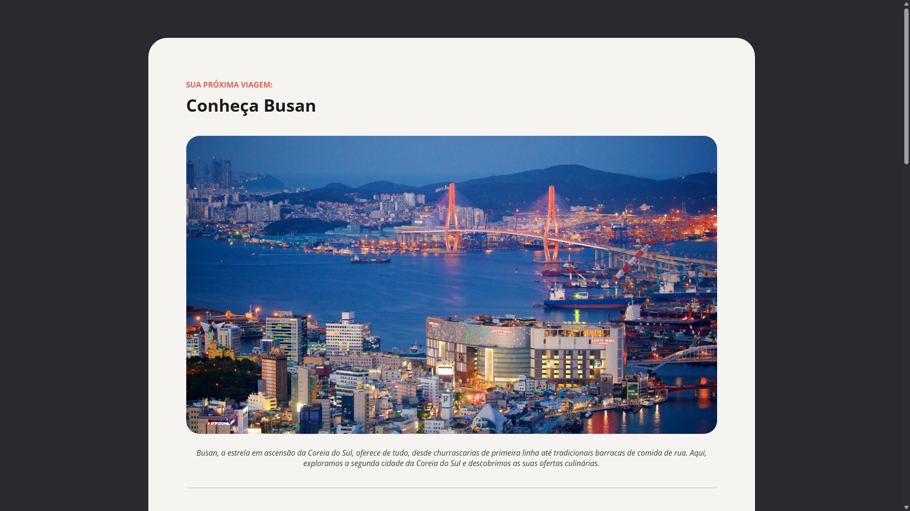

# 🌏 Site Local Turístico

Landing page desenvolvida com **HTML5** e **CSS3** apresentando um destino turístico — **Busan, Coreia do Sul** — com descrição da cidade e destaque para 3 pontos imperdíveis para quem ama história e cultura.

Este projeto foi desenvolvido como **atividade complementar do curso de HTML e CSS da [Rocketseat](https://www.rocketseat.com.br/)**, como prática de **HTML semântico** e **estilização com CSS**, sem uso de frameworks ou bibliotecas externas (apenas Google Fonts).

## 🔗 Demo

🔗 [site-local-turistico.vercel.app](https://site-local-turistico.vercel.app/)

## 🖼️ Preview



## 🚀 Funcionalidades

- Apresentação do destino turístico com imagem e descrição
- Seção com cards de atrações, cada uma com imagem, texto e tags (ex: "História", "Casais", "Famílias", "Orçamento")
- Layout responsivo e tipografia customizada (Google Fonts: Open Sans e Alice)

## 🛠️ Tecnologias utilizadas

- **HTML5**
- **CSS3**
- [Google Fonts](https://fonts.google.com/)

## 📁 Estrutura do projeto

```
Site-Local-Turistico/
├── assets/          # Imagens e ícones usados na página
├── index.html       # Estrutura principal da página
└── style.css        # Estilização da página
```

## ▶️ Como executar

Não é necessário nenhuma instalação ou dependência. Basta clonar o repositório e abrir o arquivo `index.html` no navegador:

```bash
git clone https://github.com/vinicius-lds04/Site-Local-Turistico.git
cd Site-Local-Turistico
```

Depois, abra o arquivo `index.html` diretamente no navegador (duplo clique) ou utilize uma extensão como o **Live Server** no VS Code para visualizar com recarregamento automático.

## 📌 Status do projeto

✅ Concluído — atividade complementar do curso de HTML e CSS da Rocketseat.

## 🎓 Créditos

- Layout e conteúdo base propostos pela [Rocketseat](https://www.rocketseat.com.br/) como parte do curso de HTML e CSS.
- Desenvolvimento e codificação por [Vinícius](https://github.com/vinicius-lds04).

## 👤 Autor

Desenvolvido por [Vinícius](https://github.com/vinicius-lds04).

## 📄 Licença

Este projeto tem fins exclusivamente educacionais, feito como parte de um curso da Rocketseat.
